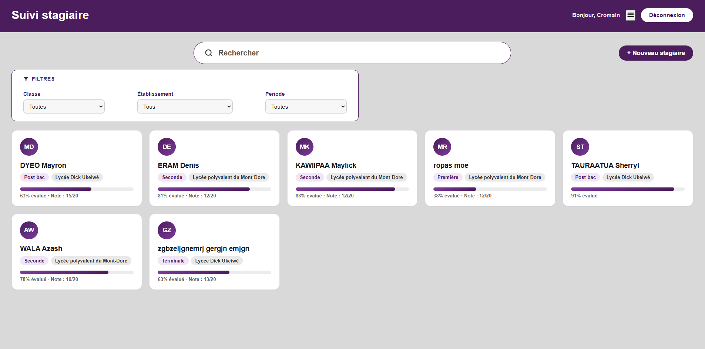

Cahier des charges – Application de suivi de la progression des stagiaires
1. Contexte du projet
Dans le cadre du suivi des stagiaires, il est nécessaire de disposer d'un outil permettant aux tuteurs de suivre l'évolution des compétences, des activités réalisées et des objectifs atteints. Cette application vise à centraliser les progressions de chaque stagiaire ainsi qu’à les noter.

2. Objectif de l’application
- Centraliser les stagiaires et leurs progressions
- Noter leurs compétences techniques/humaines et badges

3. Choix technique retenu
Le choix retenu est une application web interne simple, développée en PHP natif avec une base MySQL/MariaDB.
Élément	Choix
Langage	PHP 
Base de données	MySQL / MariaDB
Serveur web	Apache via XAMPP
Interface	HTML / CSS / JavaScript simple
Hébergement prévu	Serveur applicatif du lycée
Développement	Poste local avec XAMPP
Versioning	Git / GitHub privé côté poste de développement

4. Nom du projet
Nom retenu pour le projet : progression_stagiaires
Nom fonctionnel du site : Suivi de progression des stagiaires
5. Architecture du projet
Structure principale mise en place
1├── README.md

2├── config/

3├── index.php

4├── style.css

5├── formulaire_stagiaire.php

6├── login.php

7├── logout.php

8├── dashboard.php

6. Rôle des dossiers
Dossier	Rôle
config/	Fichiers de configuration
index.php	Pages HTML affichées à l’utilisateur
style.css	Style de la page index
formulaire_stagiaire.php	Enregistrement d’un nouveau stagiaire
login.php	Se connecter avec un compte existant
logout.php	Se déconnecter
dashboard.php	Espace personnel d’un utilisateur

7. Sécurité d’accès
Pas de système de comptes utilisateurs
Élément	Décision
Comptes utilisateurs	Non
Identifiants individuels	Non
Rôles	Non
Mot de passe unique	Oui
Session PHP	Oui
Mot de passe stocké en clair	Non
Hash du mot de passe	Oui

8. Base de données
La base créée est : staginf
Tables principales :
Table	Rôle
stagiaire	Liste des stagiaires
competence_technique	Liste des compétences techniques
competence_humaine	Liste des compétences humaines
badge	Liste des badges
evaluation_competence_technique	Notes des compétences techniques par stagiaire
evaluation_competence_humaine	Notes des compétences humaines par stagiaire
evaluation_badge	Notes des badges par stagiaire

